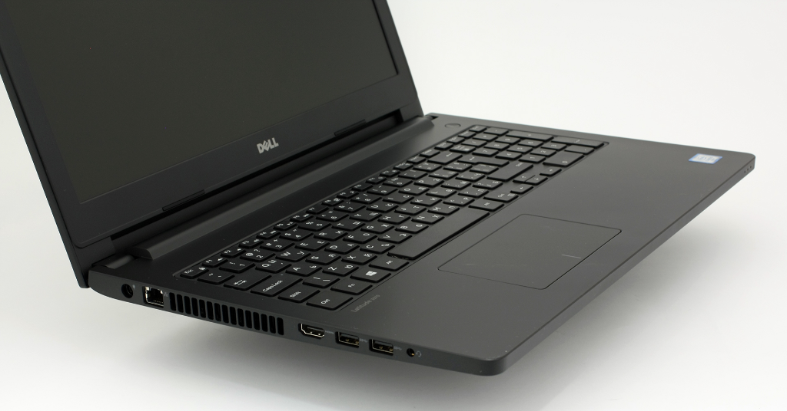

# Dell Latitude 3570 Hackintosh (OpenCore)

OpenCore EFI configuration verified on **macOS Monterey (12.7.6)** and **macOS Ventura (13.7.8)** on the **Dell Latitude 3570** laptop.

  
  
  
  
  

  

---

## 💻 Hardware Specifications

| Component | Hardware Model / Details | Status | Driver / Kext |
|---|---|:---:|---|
| **CPU** | Intel Core i5-6200U (2.30 GHz, Skylake-U, 2C/4T) | ✅ Working | Native (`SSDT-PLUG.aml`, `CPUFriend.kext`) |
| **iGPU** | Intel HD Graphics 520 (`8086:1916`, 1536 MB) | ✅ Working | `WhateverGreen.kext` (AAPL,ig-platform-id: `00001619`) |
| **Display** | 15.6" HD (1366x768 @ 60Hz) | ✅ Working | Native Backlight Control (`BrightnessKeys.kext`, `SSDT-PNLF`) |
| **RAM** | 8 GB DDR3L (2x 4GB @ 1600 MHz) | ✅ Working | Native |
| **dGPU** | NVIDIA GeForce 920M (`10de:1299`) | ❌ Disabled | `SSDT-Disable_GPU_RP01.aml` (Optimus unsupported) |
| **Audio** | Realtek ALC3246 / ALC256 (`8086:9d70`) | ✅ Working | `AppleALC.kext` (`alcid=13`) |
| **Wi-Fi** | Intel Dual Band Wireless-AC 8260 (`8086:24f3`) | ✅ Working | `AirportItlwm.kext` |
| **Bluetooth** | Intel Bluetooth Interface (`8087:0a2b`) | ⚠️ Needs user fix | Works properly when patched; current EFI lacks updated kexts (must patch yourself) |
| **Ethernet** | Realtek RTL8111/8168 PCI Express Gigabit | ❓ Untested | `RealtekRTL8111.kext` |
| **Touchpad** | Synaptics I2C (`DLL06F3:00 06CB:75DA`) | ✅ Working | `VoodooI2C.kext` + `VoodooRMI.kext` (`-vi2c-force-polling`) |
| **Webcam** | Realtek Integrated HD Webcam (`0bda:5683`) | ✅ Working | Native USB UVC |
| **Battery** | Dell ACPI Battery & Power Management | ✅ Working | `SMCBatteryManager.kext` + `SMCDellSensors.kext` |
| **Card Reader**| Realtek RTS5129 USB Card Reader (`0bda:0129`)| ❓ Untested | - |
| **HDMI Out** | HDMI Video & Audio Out | ❓ Untested | Framebuffer patch may be required |

---

## 🛠 Feature Status

### What Works
- [x] Full Intel HD 520 Graphics QE/CI acceleration and backlight brightness control
- [x] Internal speakers, 3.5mm combo headphone jack, and built-in microphone
- [x] Intel Dual Band Wireless-AC 8260 Wi-Fi
- [x] Bluetooth (Intel AC 8260) - hardware is fully functional, but requires user patching in this EFI (see below)
- [x] Synaptics I2C Touchpad with multi-touch macOS gestures
- [x] Sleep, Wake, and Lid open/close detection
- [x] Battery percentage and charging indicator
- [x] Integrated HD Webcam
- [x] OpenCanopy graphical boot menu and NVRAM reset

### What Needs Attention / Known Issues
- **Bluetooth:** The hardware works properly, but this current EFI release does **not** include the proper updated kexts yet. Users will need to patch/fix Bluetooth themselves by updating `IntelBluetoothFirmware.kext` and `BlueToolFixup.kext` (or `IntelBTPatcher.kext`) to match their target macOS version.
- **Ethernet:** Realtek RTL8168 kext included, but physical cable connection is untested.
- **HDMI Output:** External display via HDMI is untested and may require customized connector patching in DeviceProperties.
- **NVIDIA GeForce 920M:** Completely powered down via ACPI to save battery and reduce heat.
- **macOS Ventura Note:** Apple dropped native Skylake support in Ventura. Ventura requires using [OpenCore-Legacy-Patcher (OCLP)](https://github.com/dortania/OpenCore-Legacy-Patcher) to apply root patches for Intel HD 520 graphics acceleration.

---

## ⚙️ Recommended BIOS Settings

Press `F2` at power-on to enter UEFI setup:

### Disable:
- **Secure Boot** (`Security -> Secure Boot -> Disabled`)
- **Fastboot** (`Post Behavior -> Fastboot -> Thorough`)
- **Intel SGX** (`Security -> Intel SGX -> Disabled`)
- **Computrace / Absolute** (`Security -> Computrace -> Deactivate/Disable`)
- **Wake on LAN / WLAN**

### Enable:
- **SATA Operation:** `AHCI` (Critical: macOS will not detect drives in RAID mode)
- **Boot List Option:** `UEFI`
- **Intel Virtualization Technology (VT-x):** `Enabled`
- **VT-d:** `Enabled` (Disabled in config via `DisableIoMapper`)

---

## ⚠️ MANDATORY: Post-Download Setup (SMBIOS Injection)

For security and privacy reasons, this repository's `config.plist` is **sanitized** (no serial numbers or MAC addresses are included). **Your system will not activate Apple services or boot properly without personal SMBIOS credentials.**

### Step 1: Generate SMBIOS Data
1. Download [GenSMBIOS](https://github.com/corpnewt/GenSMBIOS).
2. Run GenSMBIOS (`python GenSMBIOS.py` or double-click `GenSMBIOS.command` / `GenSMBIOS.bat`).
3. Choose option `Generate SMBIOS`.
4. Enter model according to your target OS:
   - **For macOS Monterey (12.x):** Enter `MacBookPro13,1`
   - **For macOS Ventura (13.x):** Enter `MacBookPro14,1` (required to satisfy installer compatibility checks)

### Step 2: Inject Credentials into `config.plist`
1. Download [ProperTree](https://github.com/corpnewt/ProperTree) or [OCAuxiliaryTools](https://github.com/5T33Z0/OC-Little-Translated).
2. Open `EFI/OC/config.plist`.
3. Navigate to `PlatformInfo -> Generic`.
4. Fill in the generated values:
   - `SystemProductName`: `MacBookPro13,1` (or `MacBookPro14,1` for Ventura)
   - `SystemSerialNumber`: *(your generated serial)*
   - `MLB`: *(your generated Board Serial)*
   - `SystemUUID`: *(your generated UUID)*
5. For `ROM`: Enter your laptop's Ethernet or Wi-Fi MAC address (in hex, 12 characters without colons).
6. Save the file.

---

## 🚀 Installation & Usage

1. Format a USB drive as `FAT32` with a `GPT` partition table.
2. Download the pre-packaged `EFI-Dell-Latitude-3570-OpenCore.zip` from the [Releases](../../releases) tab.
3. Extract the archive directly onto your USB drive so that the folder path is `/EFI/BOOT/` and `/EFI/OC/`.
4. Perform the [SMBIOS Injection](#️-mandatory-post-download-setup-smbios-injection) on `EFI/OC/config.plist`.
5. Reboot, press `F12` to choose the USB drive, and boot the macOS installer.
